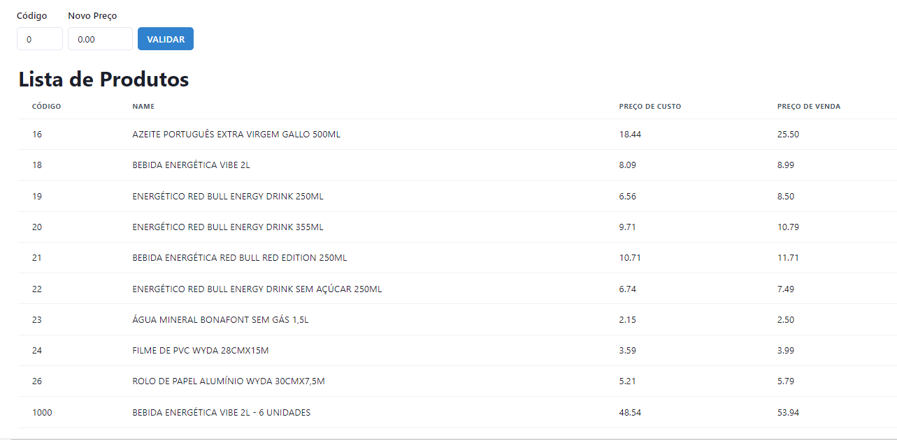
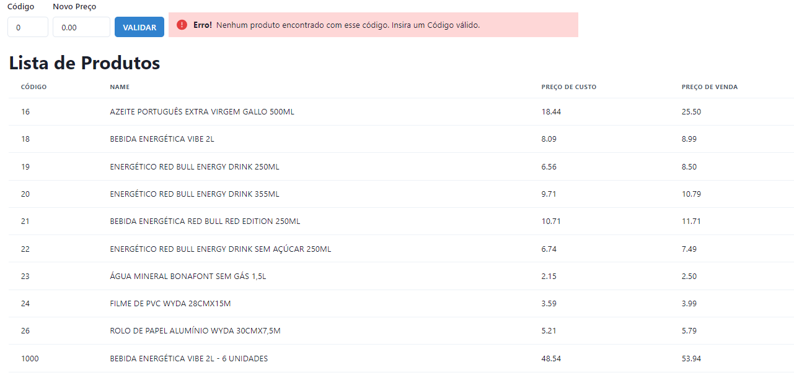
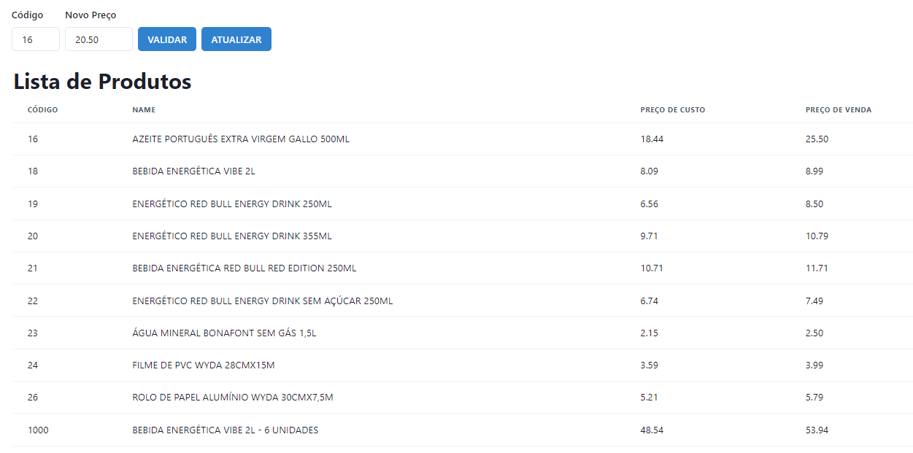

# **Projeto Pokédex**

## **Back-end**

- https://github.com/Felipe-Freitasleal/shoper_challenge_backend

## **Descrição**

Página desenvolvida como front-end como teste técnico para a empresa Shopper.

Este teste consiste no desenvolvimento de uma aplicação FullStack, com a criação de um banco de dados MySQL, consumo e consulta desse banco de dados com NodeJs, desenvolvimento de uma API para interação com o front-end e uma página no front-end.

Nesta página são renderizados os dados do banco de dados em tabelas, e é possível ao usuário atualizar o valor de algum produto pela entrada de seu código e novo valor em campos textuais, e clicando no botão "VALIDAR".

Neste ponta é gerado uma requisição, através da API, para o banco de dados. Nesse processo, é feito a verificação dos dados inseridos. Caso esteja tudo correto, é renderizado um botão chamado "ATUALIZAR". Clicando neste botão a página será carregada e os dados atualizados serão renderizados na tabela. Caso algum dado esteja errado, uma mensagem de erro aparecerá na tela.

## **Tecnologias utilizadaS**

- React
- Javascript
- CSS
- HTML
- Chakra UI
- Axios
- React Hooks

## **Funcionalidades do Projeto**

- Visualizar tabelas de produtos e pacotes
- Inserir o código e novo valor de um produto
- Atualizar o valor de um produto e do pacote que ele possa pertencer

## **Layout**

- **Home**

Estado inicial.


- **Details Page**

Alerta de erro.


- **Meus Pokémons**

Botão "ATUALIZAR" renderizado apenas em casoi de sucesso.


## **Como executar este Projeto**

```bash
 # Copie o link deste repositório e o clone em seu máquina usando o comando "git clone" em seu terminal.
 $ git clone link

 # Acesse o diretório deste projeto com o comando "cd" em seu terminal e instale as dependências necessárias com o comando "npm install".
 $ cd nome-do-diretório
 $ npm install

 # Execute este projeto com o comando "npm run start" em seu terminal.
 $ npm run start
```

## **Autor**

 

Felipe Freitas Leal

<a href="https://www.linkedin.com/in/felipe-freitas-leal/">Linkedin</a>
